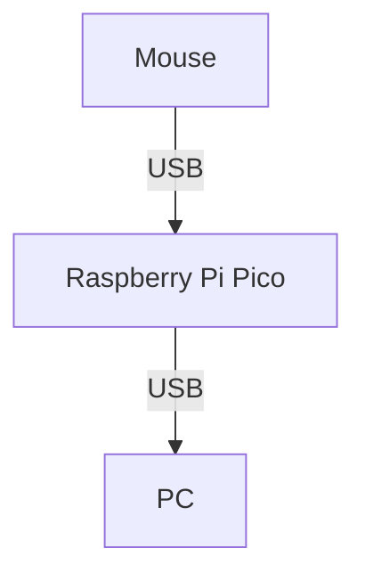

# 概要
USBマウスから上がってくるhid report descriptorをパース/変換し、pcへ送り出します。  
BitTradeOneの[TracXcroll](https://bit-trade-one.co.jp/tracxcroll/)を購入しようと思っていたのですが、設定値をデバイス側ではなくPC側に保存するようで、デバイス側に保存できるものが欲しかったため、こちらを作成しました。  

自分用に作成しているため、設定で簡単に動作を変更できるものではなく、挙動をハードコーディングしています。  

| ボタン       | 動作                                           |
| :----------- | :--------------------------------------------- |
| 左クリック   | 左クリック                                     |
| 右クリック   | 右クリック                                     |
| 中央クリック | 中央クリック                                   |
| スクロール   | スクロール                                     |
| チルト       | 無効                                           |
| 戻る         | 戻る                                           |
| 進む         | 進む                                           |
| Fn1          | Ctrl+PgUp                                      |
| Fn2          | Ctrl+PgDown                                    |
| Fn3          | トラックボールの移動をスクロールに変換(トグル) |

マウスはElecomの[M-HT1DRBK](https://www.elecom.co.jp/products/M-HT1DRBK.html)または[M-HT1URBK](https://www.elecom.co.jp/products/M-HT1URBK.html)を対象にしています。  
古いロットはreportがおかしいのか、正常に動作しません。  

Raspberry Pi PicoはAdafruitの[Adafruit Feather RP2040 with USB Type A Host](https://www.adafruit.com/product/5723)を対象にしています。  
他のRaspberry Pi Picoを利用する場合は"PIN_USB_HOST_DP"を変更する必要があります。