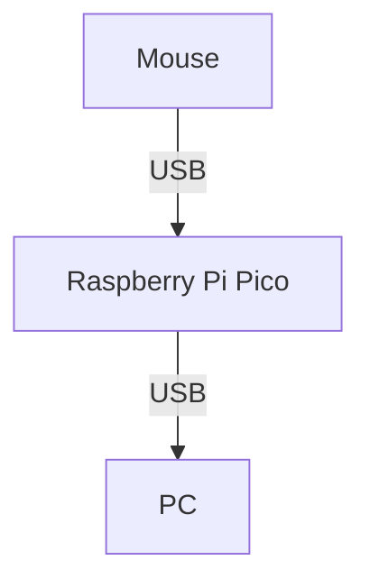

# 概要
USBマウスから上がってくるhid report descriptorをパース/変換し、pcへ送り出します。  
BitTradeOneの[TracXcroll](https://bit-trade-one.co.jp/tracxcroll/)を購入しようと思っていたのですが、設定値をデバイス側ではなくPC側に保存するようで、デバイス側に保存できるものが欲しかったため、こちらを作成しました。  



自分用に作成しているため、設定で簡単に動作を変更できるものではなく、挙動をハードコーディングしています。  

| ボタン       | 動作                                           |
| :----------- | :--------------------------------------------- |
| 左クリック   | 左クリック                                     |
| 右クリック   | 右クリック                                     |
| 中央クリック | 中央クリック                                   |
| スクロール   | スクロール                                     |
| チルト       | 無効                                           |
| 戻る         | 戻る                                           |
| 進む         | 進む                                           |
| Fn1          | Ctrl+PgUp                                      |
| Fn2          | Ctrl+PgDown                                    |
| Fn3          | トラックボールの移動をスクロールに変換(トグル) |

マウスはElecomの[M-HT1DRBK](https://www.elecom.co.jp/products/M-HT1DRBK.html)または[M-HT1URBK](https://www.elecom.co.jp/products/M-HT1URBK.html)を対象にしています。  
古いロットはreportがおかしいのか、正常に動作しません。  

Raspberry Pi PicoはAdafruitの[Adafruit Feather RP2040 with USB Type A Host](https://www.switch-science.com/products/8956)を対象にしています。  
他のRaspberry Pi Picoを利用する場合は[PIN_USB_HOST_DP](https://github.com/piguin-net/usb-hid-proxy/blob/main/main/usbh_helper.h#L21)を変更する必要があります。
(例えば[Picossci USBホスト](https://www.switch-science.com/products/9158)の場合、"PIN_USB_HOST_DP"は"0")

# 環境構築(Arduino IDE)

1. File -> Preferences -> Additional boards manager URLs  
  ```https://github.com/earlephilhower/arduino-pico/releases/download/global/package_rp2040_index.json```

1. Tools -> Board -> Boards Manager  
  ```Raspberry Pi Pico/RP2040/RP2350```

1. Tools -> Board  
  ```Adafruit Feather USB Host```

1. Tools -> Manage Libraries  
  ```Adafruit TinyUSB Library```
  ```Pico PIO USB```

1. Tools -> USB Stack  
  ```Adafruit TinyUSB```

# TODO

* 開発環境をArduino IDEからPlatformIOなどへ変更
